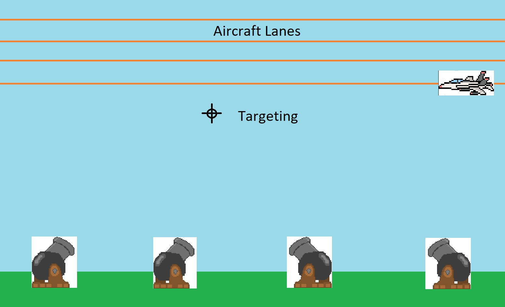

# Antair Project Template for Unity

## READ THIS FIRST

This is using Unity **2020.3.26f1**  
But, I'm sure any **2020.3.XX** LTS version would work.

Clone this repo and create a branch off of `main` before starting.; All your changes should be on that branch. Once you are done, create a Pull Request (PR). This will signify to us that you are complete.

## Game Idea (PLEASE READ CAREFULLY)

Your job is to create a 2D game with flying aircrafts and 4 projectile cannons on the ground.
Using a player-controlled crosshair, aim the cannons and shoot down the overhead aircraft. Try to get the best score in a time limit.  

The cannons on the ground are evenly spaced apart. Once a cannon fires a projectile, it should not be able to fire another projectile until it's done reloading/cooling down. Show this visually; I recommend a cooldown bar below the cannon.

The aircraft should spawn in multiple horizontal lanes in the air. Lanes can either go eastward or westward.

There are different types of aircraft, each rewarding different scores: The larger and slower the aircraft, the lower the score. The smaller and faster the aircraft, the higher the score.
Please create several (3-7) different aircraft types that are easily distinguishable.

### Concept Screenshot (Just an example, it doesn't have to look like this)

## Game Mechanics

* **Aiming**: Move a crosshair which causes all the ground cannons to adjust their aim.
* **Shooting**: Shoot a projectile from a cannon on the ground to hit a moving target in the air. After a cannon fires, it should have a cooldown period until it can fire again.
* **Projectiles**: Small cannonballs that have a travel time. They destroy the first aircraft they come into contact with and the cannonball should despawn.
* **Scoring**: Each destroyed aircraft will grant a different amount of points depending on flight speed and aircraft size.

## Game Requirements

* Main Menu Scene.
* Keyboard Input.
* Game Over when after timer runs out.
* A button to restart after Game Over.
* Score counter.
* Active timer.

### Nice to Haves

* Audio.
* A pause menu.
* A score breakdown in the Game Over screen.

### Recommended Button Scheme (Let us know if you change this)

* [1,2,3,4] Number Keys to fire cannons
* Arrow Keys to move crosshair

### Unity's New Input System

This project template is currently using Unity's new Input system. If you prefer to use Unity's legacy input system, you will need to change the settings.

Documentation on the new system:
<https://docs.unity3d.com/Packages/com.unity.inputsystem@1.0/manual/index.html>

### Included Assets

**USAGE IS OPTIONAL** -- I just thought they might be nice to have.

* An object pool written by Quill18.
* An orthographic camera resizing script.
* A platform agnostic, seeded, random number generation algorithm called Mersenne Twister.
* A tweening library called DOTween.
* An example script showing how to use Mersenne Twister and DOTween.

DOTween Documentation: <http://dotween.demigiant.com/documentation.php>

## TL;DR

Make Duck Hunt with cannons and planes.
